# Data Flow Diagram (DFD) - VocabLoury Application

## Overview
This document presents the Data Flow Diagrams (DFD) for the VocabLoury application, showing how data moves through the system from external entities to processes and data stores.

## DFD Level 0 - Context Diagram

```mermaid
graph TD
    User[👤 User] --> VocabLoury[📚 VocabLoury Application]
    VocabLoury --> User
    
    DictionaryAPI[🌐 Free Dictionary API] --> VocabLoury
    VocabLoury --> DictionaryAPI
    
    DatamuseAPI[🔍 Datamuse API] --> VocabLoury
    VocabLoury --> DatamuseAPI
    
    LocalDB[(💾 Local SQLite Database)] --> VocabLoury
    VocabLoury --> LocalDB
    
    FileSystem[📁 File System] --> VocabLoury
    VocabLoury --> FileSystem
```

## DFD Level 1 - Main Processes

```mermaid
graph TD
    User[👤 User] --> Auth[🔐 Authentication Process]
    User --> Dictionary[📖 Dictionary Process]
    User --> Learning[🎓 Learning Process]
    User --> Articles[📰 Articles Process]
    User --> Notifications[🔔 Notifications Process]
    
    Auth --> UserDB[(👥 User Database)]
    UserDB --> Auth
    
    Dictionary --> WordDB[(📝 Word History Database)]
    WordDB --> Dictionary
    
    Dictionary --> DictionaryAPI[🌐 Dictionary API]
    DictionaryAPI --> Dictionary
    
    Learning --> DatamuseAPI[🔍 Datamuse API]
    DatamuseAPI --> Learning
    
    Learning --> WordDB
    WordDB --> Learning
    
    Articles --> FileSystem[📁 Article Files]
    FileSystem --> Articles
    
    Notifications --> SystemOS[💻 Operating System]
    SystemOS --> Notifications
```

## DFD Level 2 - Detailed Process Flows

### 1. Authentication Process (Level 2)

```mermaid
graph TD
    User[👤 User] --> LoginForm[📝 Login Form]
    User --> RegisterForm[📝 Registration Form]
    
    LoginForm --> ValidateCredentials[✅ Validate Credentials]
    RegisterForm --> CreateAccount[👤 Create Account]
    
    ValidateCredentials --> UserDB[(👥 User Database)]
    UserDB --> ValidateCredentials
    
    CreateAccount --> HashPassword[🔒 Hash Password]
    HashPassword --> UserDB
    
    ValidateCredentials --> GenerateToken[🎫 Generate Token]
    GenerateToken --> TokenDB[(🎫 Token Database)]
    TokenDB --> GenerateToken
    
    GenerateToken --> LoginSuccess[✅ Login Success]
    CreateAccount --> RegistrationSuccess[✅ Registration Success]
    
    LoginSuccess --> User
    RegistrationSuccess --> User
```

### 2. Dictionary Process (Level 2)

```mermaid
graph TD
    User[👤 User] --> SearchInput[🔍 Search Input]
    SearchInput --> ValidateInput[✅ Validate Input]
    
    ValidateInput --> CheckCache[💾 Check Cache]
    CheckCache --> CacheHit{📋 Cache Hit?}
    
    CacheHit -->|Yes| DisplayResults[📄 Display Results]
    CacheHit -->|No| CallAPI[🌐 Call Dictionary API]
    
    CallAPI --> APIResponse[📡 API Response]
    APIResponse --> ProcessResponse[⚙️ Process Response]
    ProcessResponse --> UpdateCache[💾 Update Cache]
    UpdateCache --> DisplayResults
    
    DisplayResults --> SaveHistory[💾 Save to History]
    SaveHistory --> WordDB[(📝 Word History Database)]
    WordDB --> SaveHistory
    
    DisplayResults --> User
```

### 3. Learning Process (Level 2)

```mermaid
graph TD
    User[👤 User] --> GetProfession[👔 Get User Profession]
    GetProfession --> UserDB[(👥 User Database)]
    UserDB --> GetProfession
    
    GetProfession --> GenerateTopics[📚 Generate Topics]
    GenerateTopics --> CallDatamuse[🔍 Call Datamuse API]
    
    CallDatamuse --> WordSuggestions[📝 Word Suggestions]
    WordSuggestions --> GetDefinitions[📖 Get Definitions]
    
    GetDefinitions --> DictionaryAPI[🌐 Dictionary API]
    DictionaryAPI --> GetDefinitions
    
    GetDefinitions --> DisplayWords[📄 Display Words]
    DisplayWords --> User
    
    DisplayWords --> TrackProgress[📊 Track Progress]
    TrackProgress --> WordDB[(📝 Word History Database)]
    WordDB --> TrackProgress
```

### 4. Articles Process (Level 2)

```mermaid
graph TD
    User[👤 User] --> SelectArticle[📰 Select Article]
    SelectArticle --> LoadContent[📄 Load Article Content]
    
    LoadContent --> FileSystem[📁 Article Files]
    FileSystem --> LoadContent
    
    LoadContent --> DisplayArticle[📖 Display Article]
    DisplayArticle --> User
    
    User --> StartTimer[⏱️ Start Reading Timer]
    StartTimer --> TimerProcess[⏰ Timer Process]
    TimerProcess --> TimerComplete[✅ Timer Complete]
    TimerComplete --> User
```

### 5. Notifications Process (Level 2)

```mermaid
graph TD
    User[👤 User] --> ConfigureNotifications[⚙️ Configure Notifications]
    ConfigureNotifications --> SetInterval[⏰ Set Interval]
    SetInterval --> StartTimer[⏱️ Start Timer]
    
    StartTimer --> TimerLoop[🔄 Timer Loop]
    TimerLoop --> CheckTime[⏰ Check Time]
    CheckTime --> TimeUp{⏰ Time Up?}
    
    TimeUp -->|No| TimerLoop
    TimeUp -->|Yes| SendNotification[📢 Send Notification]
    
    SendNotification --> SystemAPI[💻 System API]
    SystemAPI --> SendNotification
    
    SendNotification --> LogNotification[📝 Log Notification]
    LogNotification --> NotificationDB[(🔔 Notification History)]
    NotificationDB --> LogNotification
    
    SendNotification --> User
```

## Data Stores

### 1. User Database (UserDB)
**Contents**:
- User account information
- Authentication credentials
- User preferences
- Profile data

**Operations**:
- Create user account
- Validate credentials
- Update user information
- Retrieve user data

### 2. Word History Database (WordDB)
**Contents**:
- Word search history
- User learning progress
- Word definitions and meanings
- Search timestamps

**Operations**:
- Save word searches
- Retrieve user history
- Track learning progress
- Generate statistics

### 3. Token Database (TokenDB)
**Contents**:
- Remember me tokens
- Token expiration dates
- User associations
- Session data

**Operations**:
- Generate tokens
- Validate tokens
- Delete expired tokens
- Manage sessions

### 4. Notification History (NotificationDB)
**Contents**:
- Notification logs
- Sent reminders
- User preferences
- Notification settings

**Operations**:
- Log notifications
- Retrieve history
- Update preferences
- Track delivery

## External Entities

### 1. User
**Description**: The primary user of the VocabLoury application
**Interactions**:
- Provides login credentials
- Searches for words
- Reads articles
- Configures settings
- Receives notifications

### 2. Free Dictionary API
**Description**: External API providing word definitions
**Interactions**:
- Receives word lookup requests
- Returns word definitions
- Provides pronunciation data
- Supplies usage examples

### 3. Datamuse API
**Description**: External API providing word suggestions
**Interactions**:
- Receives topic-based requests
- Returns related words
- Provides synonyms and antonyms
- Supplies word relationships

### 4. Operating System
**Description**: System-level services and notifications
**Interactions**:
- Receives notification requests
- Displays system notifications
- Manages file system access
- Handles application lifecycle

## Data Flow Descriptions

### Authentication Flow
1. **User Input**: Username, email, password
2. **Validation**: Input sanitization and format checking
3. **Database Query**: User credential verification
4. **Response**: Authentication result and user data

### Dictionary Search Flow
1. **User Input**: Word to search
2. **Input Validation**: Format and length checking
3. **Cache Check**: Look for cached results
4. **API Call**: Request definition from external API
5. **Response Processing**: Parse and format API response
6. **Storage**: Save to word history database
7. **Display**: Show results to user

### Learning Flow
1. **User Profile**: Retrieve user profession and preferences
2. **Topic Generation**: Create relevant learning topics
3. **Word Suggestions**: Request words from Datamuse API
4. **Definition Lookup**: Get definitions from Dictionary API
5. **Progress Tracking**: Update learning statistics
6. **Display**: Show learning content to user

### Article Reading Flow
1. **Article Selection**: User chooses article to read
2. **Content Loading**: Load article from file system
3. **Timer Management**: Start and manage reading timer
4. **Display**: Show article content in modal window
5. **Progress Tracking**: Monitor reading progress

### Notification Flow
1. **Configuration**: User sets notification preferences
2. **Timer Management**: Start background timer process
3. **Time Monitoring**: Check for notification triggers
4. **System Integration**: Send notification via OS API
5. **Logging**: Record notification in history database

## Error Handling Flows

### API Error Handling

```mermaid
graph TD
    APICall[🌐 API Call] --> APISuccess{✅ Success?}
    APISuccess -->|Yes| ProcessResponse[⚙️ Process Response]
    APISuccess -->|No| HandleError[❌ Handle Error]
    
    HandleError --> RetryLogic[🔄 Retry Logic]
    RetryLogic --> MaxRetries{🔄 Max Retries?}
    MaxRetries -->|No| APICall
    MaxRetries -->|Yes| FallbackData[📄 Fallback Data]
    
    FallbackData --> DisplayError[⚠️ Display Error]
    ProcessResponse --> DisplayResults[📄 Display Results]
    
    DisplayError --> User[👤 User]
    DisplayResults --> User
```

### Database Error Handling

```mermaid
graph TD
    DBQuery[💾 Database Query] --> DBSuccess{✅ Success?}
    DBSuccess -->|Yes| ProcessData[⚙️ Process Data]
    DBSuccess -->|No| HandleDBError[❌ Handle DB Error]
    
    HandleDBError --> LogError[📝 Log Error]
    LogError --> UserMessage[💬 User Message]
    UserMessage --> User[👤 User]
    
    ProcessData --> User
```

## Performance Considerations

### Caching Strategy
- **API Response Caching**: Store frequently accessed API responses
- **Database Query Caching**: Cache common database queries
- **UI State Caching**: Maintain UI state across navigation
- **File System Caching**: Cache article content and images

### Optimization Techniques
- **Lazy Loading**: Load data only when needed
- **Background Processing**: Handle time-consuming operations asynchronously
- **Connection Pooling**: Efficient database connection management
- **Memory Management**: Optimize memory usage for large datasets

---

**Document Version**: 1.0  
**Last Updated**: December 2024  
**DFD Level**: 0, 1, and 2
