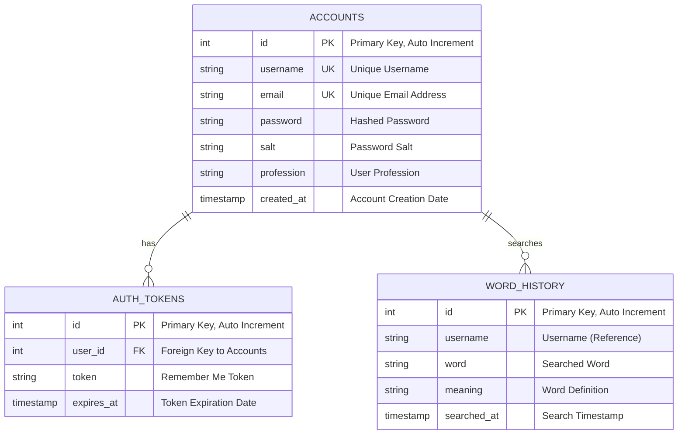

# Entity Relationship Diagram (ERD) - VocabLoury Database

## Database Overview
The VocabLoury application uses SQLite as its database management system, storing user accounts, authentication tokens, and word search history.

## Entity Relationship Diagram

## Database Schema Details

### 1. ACCOUNTS Table
**Purpose**: Stores user account information and authentication data

| Column | Type | Constraints | Description |
|--------|------|-------------|-------------|
| id | INTEGER | PRIMARY KEY, AUTOINCREMENT | Unique identifier for each user |
| username | TEXT | UNIQUE, NOT NULL | User's chosen username |
| email | TEXT | UNIQUE, NOT NULL | User's email address |
| password | TEXT | NOT NULL | PBKDF2 hashed password |
| salt | TEXT | NOT NULL | Random salt for password hashing |
| profession | TEXT | NULL | User's profession (optional) |
| created_at | TIMESTAMP | DEFAULT CURRENT_TIMESTAMP | Account creation timestamp |

**Indexes**:
- Primary Key: `id`
- Unique Index: `username`
- Unique Index: `email`

### 2. AUTH_TOKENS Table
**Purpose**: Manages "Remember Me" tokens for persistent login sessions

| Column | Type | Constraints | Description |
|--------|------|-------------|-------------|
| id | INTEGER | PRIMARY KEY, AUTOINCREMENT | Unique identifier for each token |
| user_id | INTEGER | FOREIGN KEY, NOT NULL | References accounts.id |
| token | TEXT | NOT NULL | Secure random token (64 characters) |
| expires_at | TIMESTAMP | NOT NULL | Token expiration date (30 days) |

**Indexes**:
- Primary Key: `id`
- Foreign Key: `user_id` → `accounts.id`
- Unique Index: `token`

**Relationships**:
- Many-to-One with ACCOUNTS (one user can have multiple tokens)

### 3. WORD_HISTORY Table
**Purpose**: Tracks user's dictionary search history and learned words

| Column | Type | Constraints | Description |
|--------|------|-------------|-------------|
| id | INTEGER | PRIMARY KEY, AUTOINCREMENT | Unique identifier for each search |
| username | TEXT | NOT NULL | Username (references accounts.username) |
| word | TEXT | NOT NULL | The word that was searched |
| meaning | TEXT | NULL | Word definition/meaning |
| searched_at | TIMESTAMP | DEFAULT CURRENT_TIMESTAMP | Search timestamp |

**Indexes**:
- Primary Key: `id`
- Index: `username` (for fast user history queries)
- Index: `searched_at` (for chronological sorting)

**Relationships**:
- Many-to-One with ACCOUNTS (one user can have multiple word searches)

## Database Relationships

### 1. ACCOUNTS ↔ AUTH_TOKENS
- **Relationship Type**: One-to-Many
- **Description**: One user account can have multiple authentication tokens
- **Business Logic**: Users can have multiple "Remember Me" sessions across different devices
- **Cascade Rules**: When a user is deleted, all their tokens are deleted

### 2. ACCOUNTS ↔ WORD_HISTORY
- **Relationship Type**: One-to-Many
- **Description**: One user account can have multiple word search entries
- **Business Logic**: Users can search for multiple words, building their vocabulary history
- **Cascade Rules**: When a user is deleted, their word history is preserved for analytics

## Data Flow and Business Rules

### User Registration Flow
1. User provides username, email, password, and profession
2. System generates random salt
3. Password is hashed using PBKDF2 with the salt
4. Account record is created in ACCOUNTS table
5. Username and email uniqueness is enforced

### User Authentication Flow
1. User provides username/email and password
2. System retrieves stored password hash and salt
3. Input password is hashed with stored salt
4. Hashes are compared for authentication
5. If valid, user_id is returned

### Remember Me Token Flow
1. User selects "Remember Me" during login
2. System generates secure random token (64 characters)
3. Token expiration is set to 30 days from creation
4. Any existing tokens for the user are deleted
5. New token is stored in AUTH_TOKENS table
6. Token is saved to local file for automatic login

### Word Search History Flow
1. User searches for a word in the dictionary
2. Word and definition are stored in WORD_HISTORY table
3. Username is linked to the search entry
4. Timestamp is automatically recorded
5. History can be retrieved for user's learning progress

## Security Considerations

### Password Security
- **Hashing Algorithm**: PBKDF2 with SHA-256
- **Salt Generation**: Cryptographically secure random salt (32 characters)
- **Iterations**: 100,000 iterations for key derivation
- **Storage**: Only hashed passwords are stored, never plain text

### Token Security
- **Token Generation**: Cryptographically secure random tokens (64 characters)
- **Expiration**: Tokens expire after 30 days
- **Uniqueness**: Each token is unique across the system
- **Cleanup**: Expired tokens are automatically cleaned up

### Data Integrity
- **Foreign Key Constraints**: Enforced relationships between tables
- **Unique Constraints**: Prevent duplicate usernames and emails
- **NOT NULL Constraints**: Ensure required data is present
- **Transaction Management**: ACID compliance for data operations

## Performance Optimizations

### Indexing Strategy
- **Primary Keys**: Clustered indexes for fast record access
- **Unique Indexes**: Fast lookups for username and email validation
- **Composite Indexes**: Optimized queries for user history retrieval
- **Timestamp Indexes**: Efficient chronological sorting

### Query Optimization
- **Prepared Statements**: SQL injection prevention and performance
- **Connection Pooling**: Efficient database connection management
- **Lazy Loading**: Load data only when needed
- **Caching**: In-memory caching for frequently accessed data

## Backup and Recovery

### Backup Strategy
- **Full Backup**: Complete database file backup
- **Incremental Backup**: Changes since last backup
- **Automated Backup**: Scheduled backup operations
- **Offsite Storage**: Backup files stored in secure location

### Recovery Procedures
- **Point-in-Time Recovery**: Restore to specific timestamp
- **Data Validation**: Verify data integrity after recovery
- **Rollback Procedures**: Revert to previous stable state
- **Disaster Recovery**: Complete system restoration procedures

## Database Maintenance

### Regular Maintenance Tasks
- **Vacuum Operations**: Reclaim unused space
- **Index Rebuilding**: Optimize index performance
- **Statistics Updates**: Keep query optimizer informed
- **Log File Management**: Rotate and archive log files

### Monitoring and Alerts
- **Performance Monitoring**: Track query execution times
- **Space Monitoring**: Monitor database growth
- **Error Logging**: Track and analyze database errors
- **Health Checks**: Regular system health verification

---

**Document Version**: 1.0  
**Last Updated**: December 2024  
**Database Version**: SQLite 3.x
